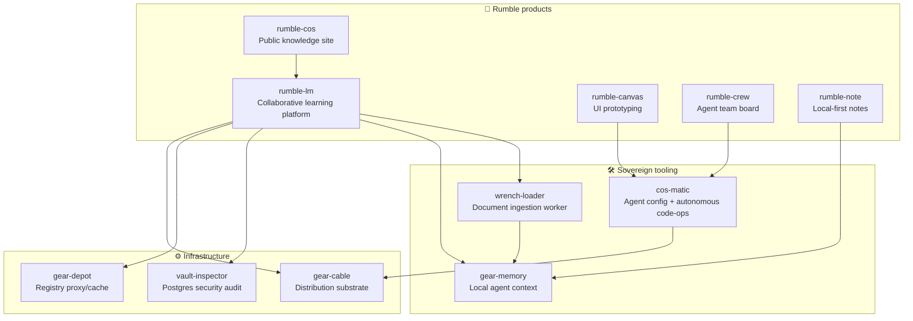

# Hey 👋 I'm Constantin

I build **resilient systems where machines decide better — without failing silently.**

## One question, one obsession

From genetic algorithms and Monte-Carlo to today's models, I've worked on the same problem:
**how does a system decide, and how do you trust the decision?** GenAI changed the _cost_ of a
machine decision, not its _nature_. The hard part was never the model — it's distribution,
adoption, and trust: teams, ops, and regulators only secure what they understand.

That conviction has a root. I came up in **critical embedded systems** — real-time, close to
the hardware (C, VHDL), zero-error tolerance, where a single undetected fault is not an option.
The principle I took from it: **a system is robust only with multiple supply lines — never a
single dependency.** At company scale that's resilience; at country scale, sovereignty.

## How that shows up in the code

- **Determinism over magic.** Reproducible outputs, no silent overwrites, no hidden state.
- **Multiple supply lines.** MIT, self-hostable, no vendor lock-in. Solution A, backup B,
  challenger C.
- **Decisions are written down.** Every non-obvious choice gets an ADR, so the _why_ is
  auditable — not just the _what_.

## Projects

| Project                                                               | Lang          | Status          | What it is                                                                                                                                                                                                                                  |
| --------------------------------------------------------------------- | ------------- | --------------- | ------------------------------------------------------------------------------------------------------------------------------------------------------------------------------------------------------------------------------------------- |
| [rumble-lm](https://github.com/constantin-jais/Rumble-LM)             | Rust          | `v0.1` · active | Self-hostable collaborative learning platform: AI-generated, source-grounded study content in real-time sessions for 200+ participants. Sovereign/BYO-keys, RGPD-compliant, Clever Cloud default.                                          |
| [rumble-cos](https://github.com/constantin-jais/rumble-cos)           | Astro/TS      | active          | Public knowledge site: courses, essays, tools, and resources about data, AI, security, and digital sovereignty.                                                                                                                             |
| [cos-matic](https://github.com/constantin-jais/cos-matic)             | Rust          | `v0` · WIP      | Deterministic, agent-agnostic **config compiler and autonomous code-ops harness**: one TOML source → native configs for many AI coding agents, safe-write, drift detection, and incident/gate orchestration.                               |
| [wrench-loader](https://github.com/constantin-jais/wrench-loader)     | Rust          | Planned         | Sovereign rich-document ingestion worker/service: Xberg-backed extraction for PDF, Office, OCR, HTML, and archives into canonical text and metadata.                                                                                        |
| [gear-memory](https://github.com/constantin-jais/gear-memory)         | Rust          | Planned         | Local agentic context layer: code map, repo memory, document/search substrate for coding agents — shaped for the cos-matic ecosystem.                                                                                                       |
| [gear-depot](https://github.com/constantin-jais/gear-depot)           | Rust          | Planned         | Sovereign supply-chain depot: Starmetal-backed registry proxy/cache and policy POC across Cargo, npm, PyPI, and other ecosystems.                                                                                                           |
| [gear-cable](https://github.com/constantin-jais/gear-cable)           | Rust          | `v0` · WIP      | Rust-first distribution substrate for multi-platform developer tools: forward-only releases, artifact plans, checksums/signatures/provenance, and sovereign install floors.                                                                 |
| [vault-inspector](https://github.com/constantin-jais/vault-inspector) | Rust          | Planned         | SQL and database security inspection: Scythe-backed lint/audit/inspect for Postgres, pgvector, RLS, grants, migrations, and CI evidence.                                                                                                    |
| [rumble-canvas](https://github.com/constantin-jais/Rumble-Canvas)     | product idea  | Planned         | Natural-language UI prototyping connected to real code.                                                                                                                                                                                     |
| [rumble-crew](https://github.com/constantin-jais/Rumble-Crew)         | product idea  | Planned         | Collaborative board for teams of humans and AI agents.                                                                                                                                                                                      |
| [rumble-note](https://github.com/constantin-jais/Rumble-Note)         | product idea  | Planned         | Local-first block notes and knowledge base.                                                                                                                                                                                                 |

_More tools ship from the same discipline — MIT, Rust, ADR-driven, deterministic._

## How it fits together

## Reach me

- **LinkedIn** — [linkedin.com/in/constj](https://www.linkedin.com/in/constj/)
- Open to talking about sovereign/self-hosted AI, agent tooling, and getting rigorous systems
  adopted in regulated spaces.

---

_Building in the open. MIT · Rust · ADR-driven · deterministic. No silent failures._
