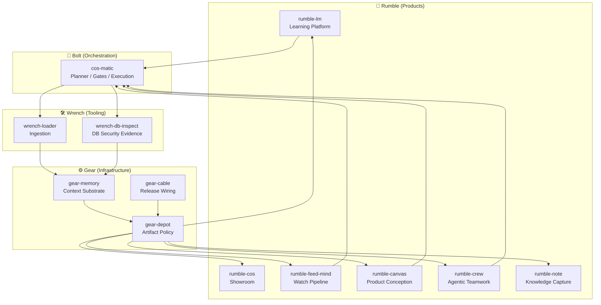

# Hey 👋 I'm Constantin

I build **product-shaped tools for learning, knowledge work, agentic teamwork, and trustworthy automation** — backed by a deterministic, sovereign forge stack.

The user-facing layer is **Rumble**. The lower layers exist to make those products reliable:
**Bolt** coordinates safe execution, **Wrench** inspects and validates, and **Gear** provides memory, distribution, provenance, and supply-chain control.

My work sits at the intersection of:

- **Rust backend & CLI tooling**
- **agentic systems and AI orchestration**
- **deterministic, auditable infrastructure**
- **sovereign / self-hostable software**
- **security, supply-chain, and regulated environments**

## What to look at first

| Product / tool | What it is for | Status | Usable today? |
| --- | --- | --- | --- |
| [rumble-cos](https://github.com/constantin-jais/rumble-cos) | Public education and knowledge surface | usable | yes |
| [rumble-feed-mind](https://github.com/constantin-jais/rumble-feed-mind) | RSS/feed intelligence pipeline for reusable knowledge | dojo | locally / experimental |
| [cos-matic](https://github.com/constantin-jais/cos-matic) | Deterministic config compiler and agentic code-ops harness | usable | yes, technical users |
| [wrench-db-inspect](https://github.com/constantin-jais/wrench-db-inspect) | SQL/Postgres/RLS/grants/migration inspection | dojo | locally / experimental |
| [gear-cable](https://github.com/constantin-jais/gear-cable) | Reproducible release and artifact wiring | contract-first | not yet |

## Dogfooding

This repository is part of the forge dogfooding loop: the ecosystem should use its own tools to make specs, maturity, contracts, releases, and product documentation observable.

Current visible evidence:

- spec-contract workflows validate ecosystem JSON schemas and fixtures;
- forge-health checks track repository workflow conventions;
- ecosystem status documents maturity and known limits across the stack.

Expected next evidence:

- link more generated reports and command transcripts from the ecosystem cockpit;
- make cross-repository release and provenance evidence easier to inspect.

Dogfooding claims should stay backed by visible commands, fixtures, CI workflows, generated reports, or linked docs.

## Product maturity

| Rumble product | Purpose | Status | Scale-ready? |
| --- | --- | --- | --- |
| [rumble-cos](https://github.com/constantin-jais/rumble-cos) | Education blog and public knowledge surface | usable | partially |
| [rumble-feed-mind](https://github.com/constantin-jais/rumble-feed-mind) | Intelligent watch pipeline | dojo | no |
| [rumble-lm](https://github.com/constantin-jais/Rumble-LM) | Grounded learning sessions and facilitation | contract-first | no |
| [rumble-canvas](https://github.com/constantin-jais/Rumble-Canvas) | Product-conception workspace | contract-first | no |
| [rumble-crew](https://github.com/constantin-jais/Rumble-Crew) | Agentic teamwork board | contract-first | no |
| [rumble-note](https://github.com/constantin-jais/Rumble-Note) | Local-first personal knowledge | contract-first | no |

**Status legend:** `speculative` = idea/exploration · `contract-first` = contracts/specs before full runtime · `dojo` = active experimentation surface · `usable` = useful for a real local workflow · `trusted` = tested, documented, gated, reproducible enough for routine use. “Scale-ready” means multi-user deployment, observability, and security hardening are in place.

## Why there is a stack underneath

From genetic algorithms and Monte-Carlo to today's models, I've worked on the same problem:
**how does a system decide, and how do you trust the decision?** GenAI changed the _cost_ of a
machine decision, not its _nature_. The hard part was never the model — it's distribution,
adoption, and trust: teams, ops, and regulators only secure what they understand.

That conviction has a root. I came up in **critical embedded systems** — real-time, close to
the hardware (C, VHDL), zero-error tolerance, where a single undetected fault is not an option.
The principle I took from it: **a system is robust only with multiple supply lines — never a
single dependency.** At company scale that's resilience; at country scale, sovereignty.

## Forge principles

- **Products first.** Rumble projects are what people touch; the stack exists to make them reliable.
- **Determinism over magic.** Reproducible outputs, no silent overwrites, no hidden state.
- **Multiple supply lines.** MIT, self-hostable, no vendor lock-in. Solution A, backup B,
  challenger C.
- **Decisions are written down.** Every non-obvious choice gets an ADR, so the _why_ is
  auditable — not just the _what_.
- **Isolated responsibility.** Each repository owns one layer and one job; composition beats scope creep.

## Ecosystem doctrine

This ecosystem is also a personal forge: a place to learn, build robust working tools, and improve the process by which ideas become specifications, inspected plans, evidence, memory, releases, provenance, and better next iterations. The Rumble projects are dojos until they are explicitly marked usable or trusted.

The projects are organized as four isolated but composable layers:

- **Rumble — Products:** what users see and use.
- **Bolt — Orchestration:** how intent becomes safe execution.
- **Wrench — Tooling:** deterministic transformation, inspection, and validation capabilities.
- **Gear — Infrastructure:** sovereign memory, distribution, integrity, and release substrate.

Rule of thumb:

> A layer may consume capabilities from lower layers, but must not absorb their responsibility.

That means a product can call an extractor without becoming one; an orchestrator can coordinate memory without owning storage; infrastructure can provide primitives without embedding business logic.

## Projects

The portfolio is split by responsibility, not by technology. Each family has a clear job in the chain: **Rumble creates learning pressure through real product-shaped experiences, Bolt coordinates decisions, Wrench provides callable capabilities and critique, and Gear supplies the sovereign forge substrate.**

Current ecosystem status is tracked in [`ecosystem/status.md`](ecosystem/status.md); the target self-improving loop is described in [`ecosystem/loop.md`](ecosystem/loop.md).

### Rumble — product experiences

**Rumble projects are what people touch.** They turn the lower layers into useful products: product-conception workspaces, learning sessions, notes, agent boards, and public knowledge surfaces.

They own UX, workflows, and product framing. They should not own raw ingestion, orchestration internals, artifact distribution, or infrastructure truth. Product needs should instead create reusable Bolt, Wrench, and Gear capabilities that feed the whole ecosystem.

| Project                                                           | Role | Product boundary |
| ----------------------------------------------------------------- | ---- | ---------------- |
| [rumble-canvas](https://github.com/constantin-jais/Rumble-Canvas) | Product conception | Turn conversations into specs, screens, and implementation-ready deliverables; not just a design canvas. |
| [rumble-cos](https://github.com/constantin-jais/rumble-cos)       | Education blog | Personal education and sharing surface for essays, courses, resources, and ecosystem explanations; not a monolithic CMS. |
| [rumble-feed-mind](https://github.com/constantin-jais/rumble-feed-mind) | Intelligent watch pipeline | Curates high-volume feeds into explainable, reusable knowledge for the harness; not the generic ingestion engine, memory substrate, or AI provider. |
| [rumble-crew](https://github.com/constantin-jais/Rumble-Crew)     | Agentic teamwork | Humans and agents side by side with tasks, status, blockers, skills, and evidence; not the orchestration brain. |
| [rumble-lm](https://github.com/constantin-jais/Rumble-LM)         | Learning facilitation | Grounded learning sessions, live activities, and audience engagement; not a generic chat app. |
| [rumble-note](https://github.com/constantin-jais/Rumble-Note)     | Personal knowledge | Local-first block notes that feed the agentic harness; not the ingestion engine or orchestrator. |

### Bolt — orchestration and decisions

**Bolt is the coordination layer.** It turns intent into safe, inspectable execution: plans, gates, delegation, safe writes, and operational evidence.

It decides how work should happen, but it should not become the product UI, the extractor, the database, or the package registry.

| Project                                                   | Role | Product boundary |
| --------------------------------------------------------- | ---- | ---------------- |
| [cos-matic](https://github.com/constantin-jais/cos-matic) | Orchestration | Deterministic config compiler and autonomous code-ops harness; not a product UI. |

### Wrench — tools and inspection

**Wrench projects are specialized capabilities.** They extract, transform, inspect, validate, and produce evidence that products and orchestrators can trust.

They do the technical dirty work, but they should not own product strategy, long-term truth, or autonomous decisions.

| Project                                                               | Role | Product boundary |
| --------------------------------------------------------------------- | ---- | ---------------- |
| [wrench-loader](https://github.com/constantin-jais/wrench-loader)     | Ingestion | Sovereign rich-document extraction to canonical text/metadata; not knowledge management. |
| [wrench-db-inspect](https://github.com/constantin-jais/wrench-db-inspect) | DB audit | SQL/Postgres/RLS/grants/migration inspection; not a vault application. |

### Gear — sovereign infrastructure

**Gear projects are the system physics.** They provide memory, distribution, policy, provenance, and release wiring so the rest of the ecosystem can stay local-first, reproducible, and sovereign.

They supply primitives. They should not contain product workflows, business logic, or agent decision-making.

| Project                                                       | Role | Product boundary |
| ------------------------------------------------------------- | ---- | ---------------- |
| [gear-memory](https://github.com/constantin-jais/gear-memory) | Memory | Local agentic context and retrieval substrate; not an agent brain. |
| [gear-depot](https://github.com/constantin-jais/gear-depot)   | Supply chain | Registry proxy/cache, provenance, and policy; not a generic file store. |
| [gear-cable](https://github.com/constantin-jais/gear-cable)   | Distribution | Rust-first release and artifact wiring; not application runtime logic. |

_More tools ship from the same discipline — MIT, Rust, ADR-driven, deterministic._

## How it fits together

## Reach me

- **LinkedIn** — [linkedin.com/in/constj](https://www.linkedin.com/in/constj/)
- Open to talking about sovereign/self-hosted AI, agent tooling, and getting rigorous systems
  adopted in regulated spaces.

---

_Building in the open. MIT · Rust · ADR-driven · deterministic. No silent failures._
