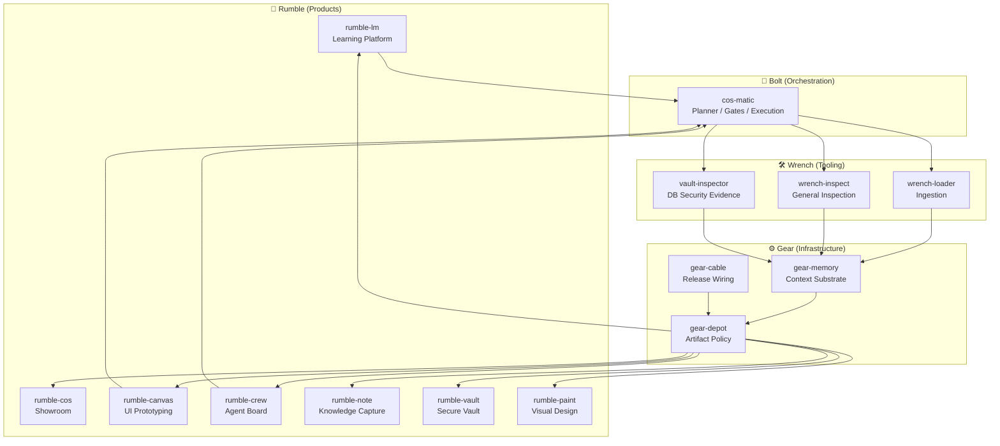

# Hey 👋 I'm Constantin

I build **resilient systems where machines decide better — without failing silently.**

## One question, one obsession

From genetic algorithms and Monte-Carlo to today's models, I've worked on the same problem:
**how does a system decide, and how do you trust the decision?** GenAI changed the _cost_ of a
machine decision, not its _nature_. The hard part was never the model — it's distribution,
adoption, and trust: teams, ops, and regulators only secure what they understand.

That conviction has a root. I came up in **critical embedded systems** — real-time, close to
the hardware (C, VHDL), zero-error tolerance, where a single undetected fault is not an option.
The principle I took from it: **a system is robust only with multiple supply lines — never a
single dependency.** At company scale that's resilience; at country scale, sovereignty.

## How that shows up in the code

- **Determinism over magic.** Reproducible outputs, no silent overwrites, no hidden state.
- **Multiple supply lines.** MIT, self-hostable, no vendor lock-in. Solution A, backup B,
  challenger C.
- **Decisions are written down.** Every non-obvious choice gets an ADR, so the _why_ is
  auditable — not just the _what_.
- **Isolated responsibility.** Each repository owns one layer and one job; composition beats scope creep.

## Ecosystem doctrine

The projects are organized as four isolated but composable layers:

- **Rumble — Products:** what users see and use.
- **Bolt — Orchestration:** how intent becomes safe execution.
- **Wrench — Tooling:** deterministic transformation, inspection, and validation capabilities.
- **Gear — Infrastructure:** sovereign memory, distribution, integrity, and release substrate.

Rule of thumb:

> A layer may consume capabilities from lower layers, but must not absorb their responsibility.

That means a product can call an extractor without becoming one; an orchestrator can coordinate memory without owning storage; infrastructure can provide primitives without embedding business logic.

## Projects

| Project                                                               | Layer | Role | Product boundary |
| --------------------------------------------------------------------- | ----- | ---- | ---------------- |
| [rumble-lm](https://github.com/constantin-jais/Rumble-LM)             | Rumble | Learning | Sovereign collaborative learning sessions; not a generic chat app. |
| [rumble-cos](https://github.com/constantin-jais/rumble-cos)           | Rumble | Showroom | Public knowledge and project distribution; not a monolithic CMS. |
| [rumble-canvas](https://github.com/constantin-jais/Rumble-Canvas)     | Rumble | Prototyping | Natural-language UI prototyping connected to code; not a full design suite. |
| [rumble-crew](https://github.com/constantin-jais/Rumble-Crew)         | Rumble | Collaboration | Human/agent task visibility; not the orchestration brain. |
| [rumble-note](https://github.com/constantin-jais/Rumble-Note)         | Rumble | Knowledge | Local-first block notes and capture; not the secure vault or ingestion engine. |
| [rumble-vault](https://github.com/constantin-jais/Rumble-Vault)       | Rumble | Knowledge | Secure local-first personal knowledge vault; not a duplicate notes app. |
| [rumble-paint](https://github.com/constantin-jais/Rumble-Paint)       | Rumble | Prototyping | Visual/spatial UI refinement; not conversational orchestration. |
| [cos-matic](https://github.com/constantin-jais/cos-matic)             | Bolt | Orchestration | Deterministic config compiler and autonomous code-ops harness; not a product UI. |
| [wrench-loader](https://github.com/constantin-jais/wrench-loader)     | Wrench | Ingestion | Sovereign rich-document extraction to canonical text/metadata; not knowledge management. |
| [wrench-inspect](https://github.com/constantin-jais/wrench-inspect)   | Wrench | Inspection | General structural/design/policy validation; not DB-specific security ownership. |
| [vault-inspector](https://github.com/constantin-jais/vault-inspector) | Wrench | DB audit | SQL/Postgres/RLS/grants/migration inspection; not a vault application. |
| [gear-memory](https://github.com/constantin-jais/gear-memory)         | Gear | Memory | Local agentic context and retrieval substrate; not an agent brain. |
| [gear-depot](https://github.com/constantin-jais/gear-depot)           | Gear | Supply chain | Registry proxy/cache, provenance, and policy; not a generic file store. |
| [gear-cable](https://github.com/constantin-jais/gear-cable)           | Gear | Distribution | Rust-first release and artifact wiring; not application runtime logic. |

_More tools ship from the same discipline — MIT, Rust, ADR-driven, deterministic._

## How it fits together

## Reach me

- **LinkedIn** — [linkedin.com/in/constj](https://www.linkedin.com/in/constj/)
- Open to talking about sovereign/self-hosted AI, agent tooling, and getting rigorous systems
  adopted in regulated spaces.

---

_Building in the open. MIT · Rust · ADR-driven · deterministic. No silent failures._
